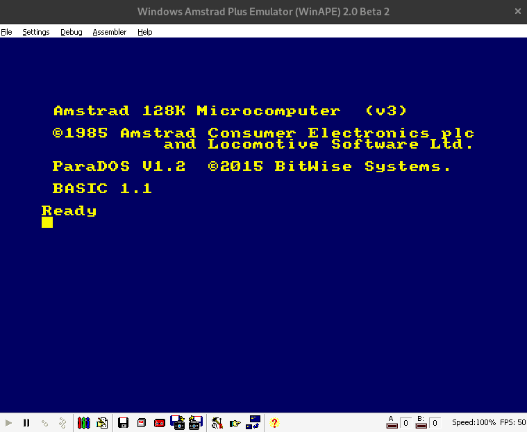

# Amstrad CPC MACHINE CODE
Particular exercises and completed challenges of the Retroman Program

I present here the challenges and some particular exercises performed by me and some reasoning of how these results were reached. The challenges and some challenges explained in diagrams can be found here --> [EXPLANATION AND RESULTS](https://github.com/aggranadoss/amstradcpc-machine-code/tree/master/amstrad_cpc_exercises_resolved).

It is a program that can be found on the channel [YOUTUBE RETROMAN](https://www.youtube.com/@ProfesorRetroman/about) and you can also get the base 
program at the web link [PROFESOR RETROMAN](https://profesorretroman.com/) with a complete machine language course and assembler on Z80. All executable 
files are in binary format and are executed in winape. If you want to install and test the binary, here is the video supported by the CPCtelera community [OS-LINUX UBUNTU](https://www.youtube.com/watch?v=aItoD7OfdkM), [MAC OSX](https://www.youtube.com/watch?v=4a_dh0WXWic) and [OS-WINDOWS](https://www.youtube.com/watch?v=YIrbPEinYp0&list=RDCMUCSdIAKvPxlB3VlFDCBvI46A&index=3)

The image of the Amstrad CPCtelera

